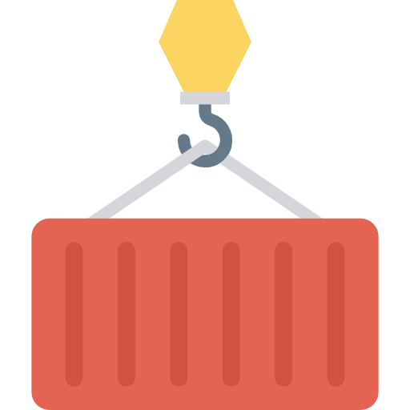

  
  
  
  
  
   
  
  
  

---

## What is Undock?

**Undock** is a CLI application that allows you to extract contents of a
container image in a local folder. This can be useful if you use a registry
to store artifacts in a scratch image, and you want to extract them on your
local machine with a single command.

See the [usage examples](usage/examples.md) for more info.

## Features

* Can extract multi-platform images
* Include a subset of files/dirs
* Cache support

## License

This project is licensed under the terms of the MIT license. 
Icon credit to [DinosoftLabs](https://dinosoftlab.com/).
